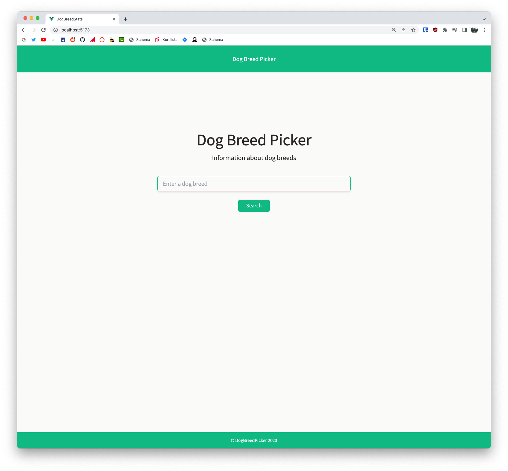
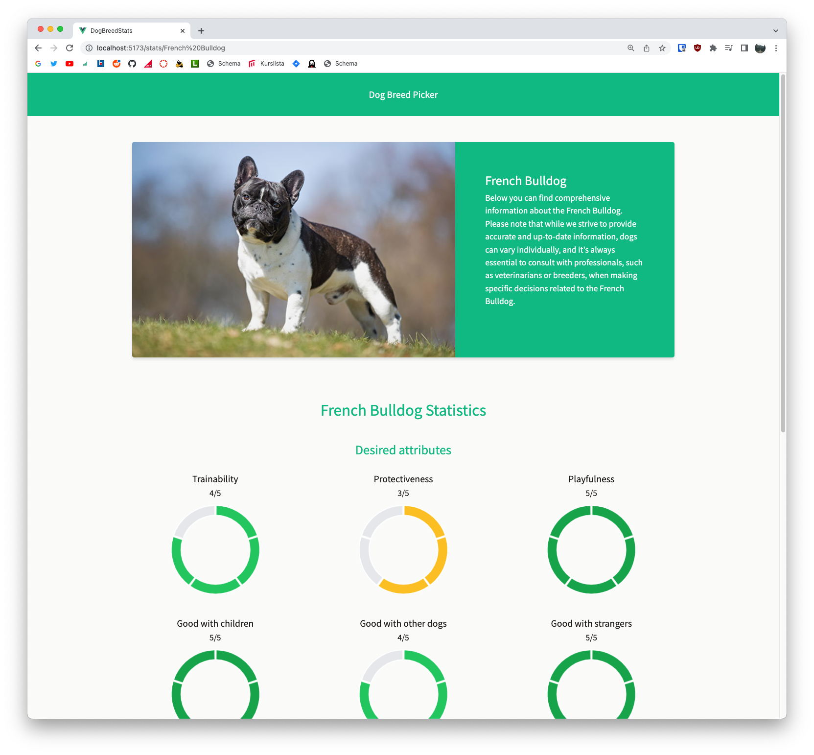
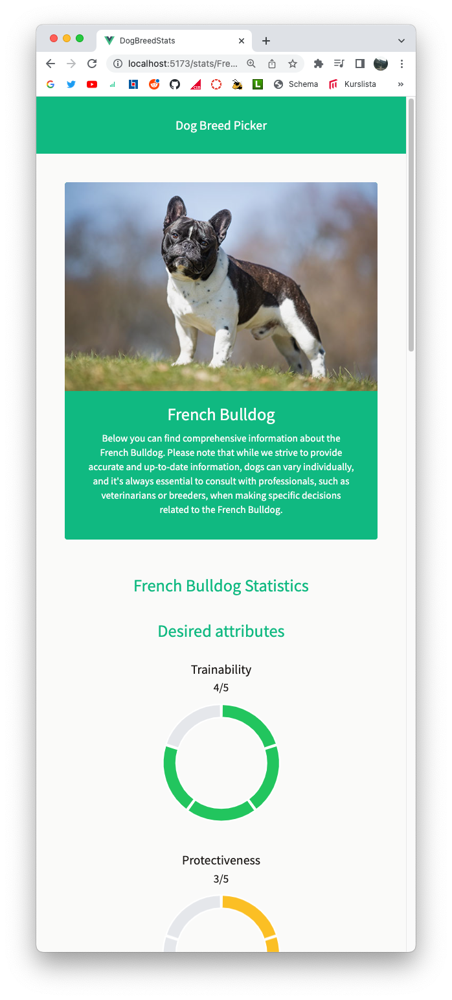
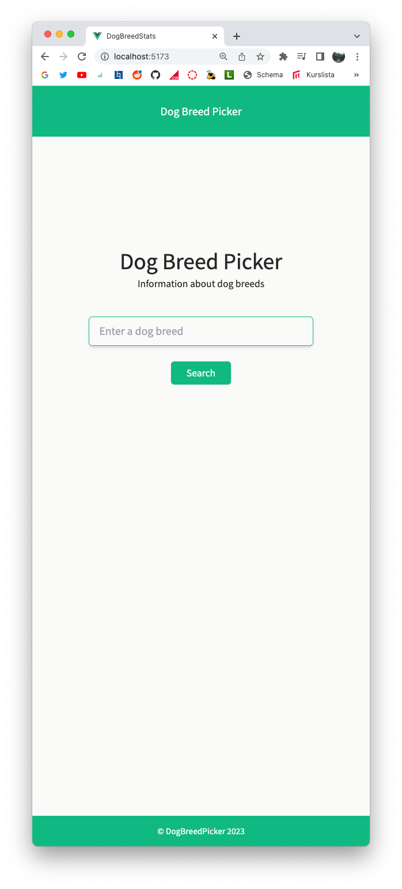

# Dog Breed Stats
Dog Breed Stats is an responsive website where users can find attribute statistics of different dog breeds. Users search for a dog breed, and is then shown an image of the breed, alongside it's stats presented visually by doughnut charts. It's an extra assignment for DA395A to pass the course with distinction.

## Website functionality and responsiveness


## Screenshots
### Desktop



### Mobile



## API
I used the [Dogs API](https://api-ninjas.com/api/dogs) provided by API Ninjas for this project.

## Frameworks & Libraries 
I used the following frameworks and libraries in this project. The two external libraries which were an requirement for the project are displayed in bold text. 
- [Vue 3](https://vuejs.org/) + [Vite](https://vitejs.dev/)
- [Tailwind CSS](https://tailwindcss.com/)
- **[Axios](https://axios-http.com/)** for API calls
- **[Chart.js](https://www.chartjs.org/docs/latest/)** for creating doughnut charts to display they breed statistics

## Getting started
1. To host the website, an API key is needed. It can be aquired [here](https://api-ninjas.com/register) for free by registering for an account. 

2. Once an API key has been aquired, create a file called **apikey.js** and put it in the **src** folder. 
Enter the following line in apikey.js:

```javascript
export default "[INSERT API KEY HERE]";
```

3. Then run the follwing command to install all packages:

```sh
npm install
```

4. Then run the follwing command to start the server:

```sh
npm run dev
```

5. Navigate to http://localhost:5173/ in your browser.

##### Compile and build for Production
```sh
npm run build
```

## License
This project is licensed under the MIT License.

## Note to Teacher
I decided to try and do all merges of my branches locally in this project, instead of creating pull requests on GitHub as I usually do, to learn new ways of working with git and GitHub. After mergeing locally, I deleted the old branches that were behind master, locally and on GitHub. I didn't realize until I was almost finished, that by doing it this way, the merges won't be displayed in the commit history. I managed to restore the old branches that I had deleted, but after restoration, they show commit history as snapshots of all commits up until that point in time. This is the reason to why it might look a bit strange in the branches tab. When I discovered this, I switched to my usual way of creating pull requests on GitHub, so the branches that were created in the later phase of the project look as the should. All commits for each respective branch can also be found [here](https://github.com/antonholmCO/dog-breed-stats/activity).
